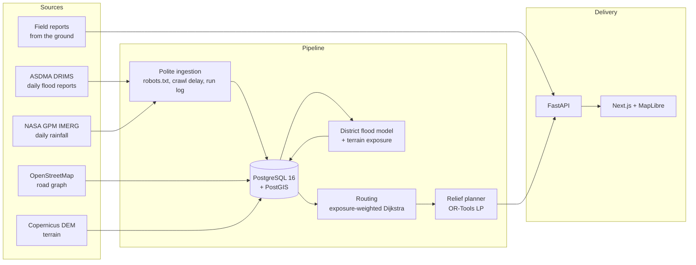

# SetuNER

**Road accessibility forecasting and relief logistics for flood-prone Assam.**

Existing systems report that a flood is happening. SetuNER estimates **which
roads will still work tomorrow**, and **what can reach the people who need
supplying** — from live government reports, satellite rainfall, terrain and
field reports, with every number traceable to its source.

[](https://github.com/mKs2609/setu_ner/actions/workflows/ci.yml)


| | |
|---|---|
| **Live app** | https://setu-ner-web.vercel.app |
| **API** | https://setuner-api.onrender.com · [interactive docs](https://setuner-api.onrender.com/docs) · [readiness](https://setuner-api.onrender.com/api/v1/health/ready) |
| **Coverage** | Barak Valley corridor, Assam — Cachar, Karimganj (Sribhumi), Hailakandi, Dima Hasao |
| **Data** | 110,266 road segments · 321 daily flood reports since May 2025 · 515 days of satellite rainfall · updated every morning |

> The API runs on a free instance that sleeps when idle. The first request
> after a quiet spell can take up to a minute.

---

## What it does

**1 · Forecasts accessibility, not just flooding.**
A statewide model predicts whether each Assam district will be flood-affected
1 and 3 days out. That probability becomes a per-road accessibility score
(`1 − P(affected) × terrain exposure`) for every segment in the corridor, with
its model version and as-of date attached. Every forecast is stored and
**graded against a "tomorrow looks like today" baseline once the outcome
arrives** — including when it loses.

**2 · Plans relief deliveries under real constraints.**
Demand comes from people actually in relief camps (from the daily reports),
turned into water and food requirements using cited humanitarian norms. A
lexicographic linear program decides what each depot sends where, on routes
that trade travel time against exposure to at-risk roads. The plan reports
**which constraint is binding** — stock, trucks or reachability — from the
LP's own dual values.

**3 · Answers "what if this bridge closes?"**
Close or flood any set of roads and get the routing consequence: the new
route, the delay, or that a place is cut off entirely.

**4 · Shows its work, and keeps a record.**
Every forecast, road score and plan can be explained feature by feature, with
contributions that sum exactly to the prediction. Saved plans are immutable
snapshots; operator overrides are an append-only log of what was done
instead, and why.

---

## How it works



**Forecast → road score.** The model is trained statewide (34 districts) because
the four corridor districts alone have too few flood onsets to learn from.
Per-road spread uses a *stated* terrain prior — height above the district's
low ground — which is documented as an assumption, not a fitted result,
because the corridor has only 25 geolocated damage reports to check it with.

**Routing.** Costs combine travel time with "exposure-km" (distance weighted by
how inaccessible each road is forecast to be), so a planner can pay a stated
number of minutes to avoid risk. Shortest paths run on a compiled SciPy
Dijkstra over a cached sparse matrix: ~10× faster than the previous
NetworkX version and small enough for a 512 MB instance.

**Planning.** GLOP solves coverage first, then fairness, then truck-hours, so a
plan cannot quietly trade away coverage for convenience.

---

## Results, stated honestly

Trained on the 2025 monsoon, tested once on the held-out 2026 season
(4,585 district-days). Lower Brier is better; AUC 0.5 means no skill.

| 1-day forecast | Brier | Overall AUC | Onset AUC |
|---|---|---|---|
| Climatology | 0.1050 | 0.500 | 0.500 |
| Persistence ("same as today") | 0.0394 | 0.895 | 0.500 |
| **Logistic regression (served)** | **0.0393** | **0.936** | **0.708** |

The headline Brier is nearly a tie with persistence — because most district-days
are quiet and persistence gets those right for free. The difference is
**onset**: persistence is blind to a flood that has not started (AUC 0.500 by
construction), and the model ranks new onsets meaningfully better.

**Where it is not winning:**

- **3 days out, persistence is served.** The logistic model did not beat it on
  validation, so the baseline is what runs. That is the honest outcome, not a
  bug to hide.
- **The live track record is currently negative** (1-day skill −1.8% over 243
  graded forecasts, with only 7 positives in a quiet post-monsoon spell). It is
  published on the model page rather than hidden, and is the first thing the
  post-season retrain must address. It has moved the way the small-sample
  hypothesis in `docs/retraining.md` predicted — −37% at 175 graded forecasts,
  −4.7% at 209, −1.8% at 243 — which is evidence, not a verdict.
- **Rainfall is collected but not served.** A model using it was better on the
  2026 test season (Brier 0.0388, onset AUC 0.756) but worse on the validation
  folds the selection rule uses. Changing the rule after seeing the test would
  make the test meaningless, so instead it runs as a **shadow test**: scored
  daily beside the served model, graded only on days neither has seen, against
  a promotion rule fixed in advance (`docs/decisions/0015`).

---

## Engineering

| Area | What is in place |
|---|---|
| **Tests** | 308, covering label rules, validation leakage, artifact loading, optimiser behaviour, auth, deployment invariants; CI runs API tests, both Docker builds and the web build on every push |
| **Ingestion** | robots.txt honoured per host, crawl delay, retries only on transient failures, size caps, honest user agent; every attempt written to a run log before it starts, so a killed run is visible and still owed |
| **Data integrity** | Ingestion only ever inserts. A source going down shows as rising staleness plus a failed run, never as an empty map that could read as "all clear" |
| **Model safety** | Artifacts are JSON (not pickle), carry their own feature list, and are refused if they name an input the code cannot compute. A model that loses to its baseline serves the baseline |
| **Security** | Operator tokens stored as SHA-256 hashes, compared in constant time; writes require a token, refused before the body is parsed; a production config guard refuses to start with default credentials, a local database, wildcard CORS or no tokens; every public input is bounded |
| **Operations** | `/health/ready` checks database, PostGIS, tables, migrations, road data, freshness per feed, model artifacts and data files; one entrypoint (`app.jobs.daily`) for every scheduler |
| **Abuse limits** | The heavy public endpoints (planning, scenarios) share one concurrency slot and a per-address rate limit, so one caller cannot hold the only worker while everyone else waits. Stated as a nuisance limit, not a security boundary |
| **Performance** | Map GeoJSON is built inside PostGIS and gzipped (28.7 MB → 3.2 MB, and no longer exhausts a 512 MB host); planning is bounded by a concurrency semaphore that returns 429 rather than dying |

---

## Repository layout

```
apps/
  api/                 FastAPI service
    app/
      routers/         HTTP endpoints
      services/
        ingestion/     Government report pipeline (polite client, parsers, schedule)
        weather/       NASA IMERG rainfall
        model/         Dataset rules, training, scoring, shadow test
        logistics/     Demand, routing, OR-Tools planner
        explain/       Per-feature attribution, narratives, audit
        scenario/      What-if engine
      db/              Models, session, migration runner
    tests/             308 tests
  web/                 Next.js 14 + MapLibre
geo/                   One-off builders: road graph, terrain, gazetteer, rainfall boxes
ml/models/             Trained model artifacts (JSON, versioned)
infra/migrations/      Idempotent SQL migrations
scripts/               Scheduling, deployment, data-access checks
docs/decisions/        Numbered decision records — why things are the way they are
```

---

## Running it locally

**Prerequisites:** Python 3.12, Node 20+, pnpm, PostgreSQL 16 with PostGIS
(or Docker).

```bash
cp .env.example .env
cp apps/api/.env.example apps/api/.env
pnpm install
docker compose up -d postgres          # or point DATABASE_URL at your own
cd apps/api && pip install -r requirements.txt
python -m app.db.migrate               # extensions, tables, migrations
uvicorn app.main:app --reload --port 8000
```

```bash
pnpm --filter @setu_ner/web dev        # http://localhost:3000
```

The API serves interactive docs at http://localhost:8000/docs. A fresh
database has the schema but no road graph; `geo/osm/` rebuilds it from
OpenStreetMap, and `docs/deployment.md` covers restoring a dump instead.

**Tests:**

```bash
cd apps/api && python -m pytest -q
```

---

## Operating it

| Task | Command |
|---|---|
| Daily update (ingest, rainfall, match damage, re-score) | `python -m app.jobs.daily` |
| Train and evaluate the model | `python -m app.services.model.train` |
| Check the rainfall source end to end | `python -m app.services.weather.check` |
| Issue an operator token | `python -m app.security new-token` |
| Apply migrations | `python -m app.db.migrate` |

The daily job runs on a scheduled task in India, because the ASDMA portal does
not answer requests from cloud regions outside it — found the hard way, on a
hosted run that sat for 17 minutes and ingested nothing. Missed days are
caught up automatically; see `scripts/scheduling/README.md` and
`docs/retraining.md`.

---

## Design decisions

Numbered records, never deleted — including the ones that record a failure:

| | |
|---|---|
| [0001](docs/decisions/0001-gap-analysis-and-enhancements.md) | Gap analysis: what the original plan assumed, and what the data actually allows |
| [0002](docs/decisions/0002-corridor-selection.md) | Why the Barak Valley corridor |
| [0003](docs/decisions/0003-scenario-engine.md) | The what-if engine, and what its numbers do and do not mean |
| [0004](docs/decisions/0004-live-hazard-ingestion.md) | Live ingestion, and the district rename that would have broken it silently |
| [0005](docs/decisions/0005-field-report-fusion.md) · [0006](docs/decisions/0006-corroboration.md) | Field reports, reporter trust, and why evidence may support a report but never count against one |
| [0007](docs/decisions/0007-current-conditions-routing.md) | Routing from current conditions |
| [0008](docs/decisions/0008-scheduled-ingestion.md) | Scheduling, and why catch-up beats "fetch yesterday" |
| [0009](docs/decisions/0009-terrain-and-satellite-coverage.md) | Terrain per road, and why Sentinel-1 flood extent is *not* built |
| [0010](docs/decisions/0010-accessibility-model.md) | The forecasting model, its results, and why a baseline is served at 3 days |
| [0011](docs/decisions/0011-demand-and-supply-planning.md) | Demand from relief-camp populations; the optimiser and its binding constraints |
| [0012](docs/decisions/0012-explanations-and-audit-trail.md) | Explanations that reconstruct the prediction; immutable plans and overrides |
| [0013](docs/decisions/0013-deployment-readiness.md) | What had to exist before a public URL |
| [0014](docs/decisions/0014-rainfall-input.md) | Rainfall: sources checked, built, and why it is not served yet |
| [0015](docs/decisions/0015-shadow-test.md) | The shadow test, with its promotion rule fixed in advance |

---

## Limitations

Stated plainly, because a disaster tool that oversells itself is worse than none:

- **No rainfall in the served model yet** — it is collected and on trial (above).
- **The per-road terrain prior is an assumption**, not a fitted model. 25
  geolocated damage reports is too few to validate it, and the interface says so.
- **Depot stock and fleet are operator inputs.** The defaults are examples and
  are labelled as such wherever a plan is shown.
- **No alerting.** A failed run is visible in the API and the logs, but nothing
  pages anyone.
- **Sentinel-1 flood extent is not built** — it needs a Copernicus account and a
  SAR pipeline, and a plausible-looking one would be worse than none.
- **One corridor.** The schema and pipeline are hazard-agnostic and statewide,
  but the road graph, terrain and gazetteer cover the Barak Valley.

## Roadmap

1. Post-season retrain (~November), including why live skill went negative.
2. Shadow-test verdict on rainfall — expected during the 2027 monsoon.
3. Alerting on stale data or failed runs.
4. Vector tiles, so the map scales past one district at a time.

---

## Data sources and attribution

| Source | Used for | Licence / terms |
|---|---|---|
| [ASDMA DRIMS](https://sdmassam.nic.in/) daily flood reports | District flood state, damage, relief-camp populations | Government of Assam public reports |
| [NASA GPM IMERG](https://gpm.nasa.gov/data/imerg) Late Run V07 | Daily rainfall per district | NASA open data; free Earthdata account |
| [OpenStreetMap](https://www.openstreetmap.org/copyright) | Road graph, district boundaries, gazetteer | © OpenStreetMap contributors, ODbL |
| [Copernicus DEM](https://dataspace.copernicus.eu/) | Road elevation and terrain exposure | Copernicus open data |
| Sphere Handbook | Water and food norms per person per day | Cited in the interface at point of use |

Every automated fetch respects the source's `robots.txt` and crawl delay, and
identifies itself honestly. If a source asks us to stop, the correct response
is to stop.

## Licence

Source code: [MIT](LICENSE). The data keeps its own terms — in particular,
anything derived from OpenStreetMap is ODbL 1.0.
